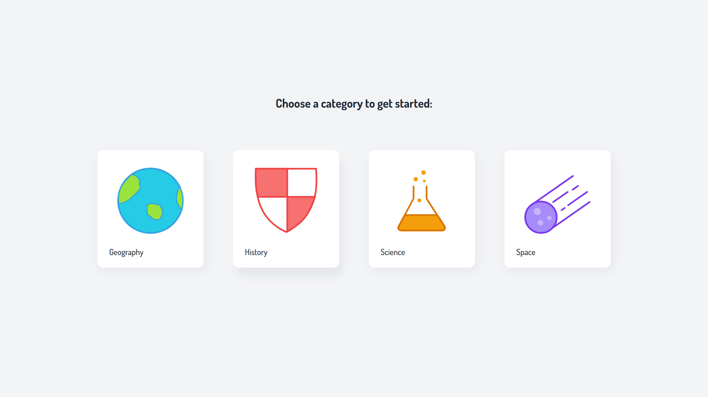
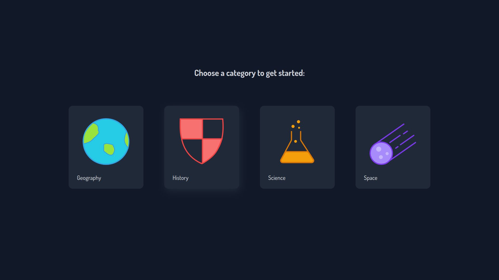

# Quizzify

An simple quiz app with 5-question quizzes on different topics, built with
React and Tailwind CSS. See it live [here](https://react-quizzify.netlify.app).

## Screenshots

Light mode:



Dark mode:



## Installation

First, clone this repo:

```bash
git clone https://github.com/thamika123/react-quizzify.git
```

Install all dependencies:

```bash
npm install
```

Run Parcel:

```bash
npm run serve
```

Open your browser and navigate to `localhost:1234`.
